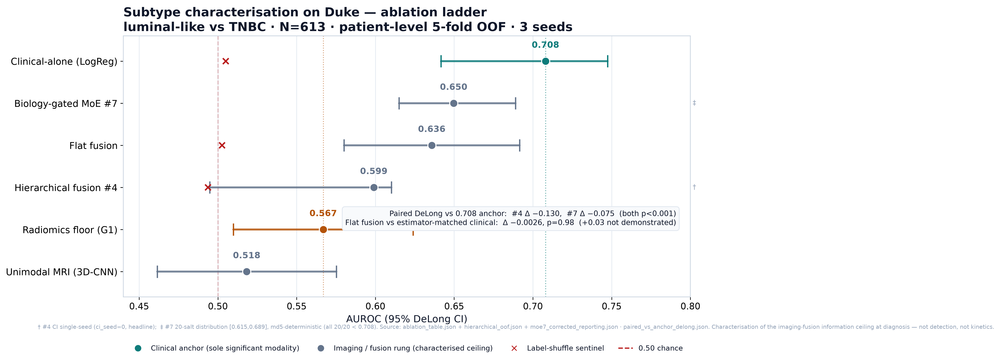

# PinkSight

Multimodal DCE-MRI + clinical fusion for breast-cancer **subtype characterisation** and **Ki-67
stratification at diagnosis**, with explainable cross-attention fusion. Team TestEin, OPSI 2026.

> **Research artifact, not a clinical product.** Every task is **characterisation / localisation at
> diagnosis** (subtype, aggressiveness). PinkSight does **not** do early/pre-detection, growth-rate or
> tumour-kinetics estimation, or cross-institution generalisation. <!-- # allow-ledger --> It is a set of **per-cohort
> organs** — each with its own number on its own patient-disjoint cohort; a number from one cohort is
> never pooled with, compared to, or juxtaposed against a number from another. See
> `docs/CLAIM_LEDGER.md`.

## The finding: an honest null

On the Duke cohort, a **clinical-only baseline carries the subtype signal**, and every imaging and
fusion rung sits **below** it. The clinical-only anchor is the only modality with meaningful
discrimination; the radiomics floor, unimodal MRI, flat fusion, hierarchical fusion, and the
biology-gated mixture-of-experts all score under it (see the table below, and the full matrix in
[`results/Table2_results.md`](results/Table2_results.md)).

The fusion-versus-clinical margin is **not demonstrated** at the available sample size — it is
**underpowered, not rejected**. The pre-registered +0.03 AUROC margin is not detectable at N=613
(the minimum detectable effect is roughly twice that margin), so every fusion rung is reported as
*not demonstrated*, never as *rejected*, and never as evidence that imaging adds separable subtype
signal on this cohort. Whether the architecture can exploit an imaging signal on a cohort where one
is demonstrable is an untested forward hypothesis, not a conclusion drawn here.

The methods contribution is the leakage-safe architecture itself — a hierarchical late-clinical
fusion and a biology-gated mixture-of-experts (HR-status routing leakage was caught and rejected in
favour of grade-band routing) — reported honestly against a characterised information ceiling, not a
performance headline.

## Real results vs synthetic wiring — the firewall

This repository keeps two kinds of numbers **strictly separate**:

- **Real results** live in [`results/Table2_results.md`](results/Table2_results.md). Each is a
  *within-cohort* measurement on its own patient-disjoint cohort, reported with a DeLong confidence
  interval, calibration (ECE), and multi-seed spread — never a bare number. A number from one cohort
  is never pooled with, compared to, or juxtaposed against a number from another (LOCK-1).
- **Synthetic wiring proofs** are what `make demo` prints: control-sentinel numbers tagged
  **`SYNTHETIC — NOT A RESULT`**. They prove only that the code runs end-to-end — a *negative*
  control collapses to the label-shuffled floor (the pipeline invents nothing) and a *positive*
  control recovers a known injected signal. They are never a scientific claim and never real-patient
  data.

The two are never mixed: a synthetic sentinel is never reported as a result, and a real result is
never produced by the synthetic demo.

## Results — the Track-A ablation ladder



The headline is the Track-A subtype ablation ladder below, reproduced **verbatim** from
[`results/Table2_results.md`](results/Table2_results.md) (which also holds Track B, the companions,
and the G5 calibration / quasi-external / explainability rows). Values here are a byte-for-byte copy —
this project never re-types or rounds a reported number.

## Track A — Duke subtype characterisation (luminal-like vs TNBC, N=613 MRI+clinical bi-modal intersection, patient-level 5-fold OOF, 3 seeds)

| Result | Estimator | AUROC [DeLong CI95] | ECE | Shuffle | Verdict | Source |
|---|---|---|---|---|---|---|
| Radiomics floor (G1) | LogReg (107 feat) | 0.567 [0.510, 0.624] | 0.068 | — | LOCK-4 floor | `G1_baseline/metrics.json` |
| **Clinical-alone (anchor)** | **LogReg (C=1.0)** | **0.708 [0.642, 0.747]** | 0.0196 | 0.505 | **only modality w/ meaningful discrimination** | `ablation_table.json` (0.708) · `G5_external.json` (CI, H6 anchor) · `G5_calibration.json` (ECE) |
| Unimodal MRI | 3D-ResNet-18 + probe | 0.518 [0.462, 0.575] | — | — | null | `G3…/ablation_table.json` |
| Flat fusion | concat cross-attn | 0.636 [0.580, 0.692] | 0.253 | 0.503 | null — descriptive Δ vs 0.708 = −0.072; paired Δ vs **estimator-matched** clinical (~0.638) **−0.0026, p=0.98** (CI incl. +0.03 → not demonstrated) | `G3…/delong_deltas.json` |
| Hierarchical fusion #4 | staged late-clinical | 0.599 (per-seed mean); pooled-OOF ensemble 0.6365 [0.582, 0.691]† | — | 0.494 | null — descriptive Δ vs clinical −0.109; **paired DeLong Δ vs 0.708 anchor −0.130** (Stouffer p≪0.001; aligned N=613); still < 0.708 | `G3…/hierarchical_oof.json` · `G3…/paired_vs_anchor_delong.json` |
| Biology-gated MoE #7 | grade-band routing | **0.650 ± 0.018 [0.615, 0.689]** (20-salt sweep; all 20/20 < 0.708, closest 0.689; md5-deterministic instance 0.6542; pooled-OOF ensemble 0.6682 [0.613, 0.723]†) | — | — | null (< clinical); **paired DeLong Δ vs 0.708 anchor −0.075** (Stouffer p≪0.001); expert class-purity e0 0.876±0.015 / e1 0.717±0.012 (routing purity, NOT a per-expert AUROC) | `G3…/moe7_corrected_reporting.json` · `G3…/moe_salt_sweep/` · `G3…/paired_vs_anchor_delong.json` |
| Imaging closing arm (G2) | 3D-ResNet-18 corrected | 0.491 [0.395, 0.587] | — | 0.490 | null (6-axis independent) | `G2…/run_r18_mn_corrected_smoke` |

> **Power / MDE (paired fusion-vs-clinical-anchor leg, N=613):** the pre-registered +0.03 ΔAUROC margin
> is NOT detectable at N=613 — minimum detectable effect at 80% power ≈ 0.066–0.073 (≈2× the margin;
> ~2,900–3,600 patients needed to detect +0.03). Every fusion rung is *not demonstrated*, not *rejected*.
> Source: `G3…/mde_power.json`.

## Architecture

PinkSight is presented as **one modality-dropout skeleton hosting many separately-trained organs**,
each fit on its own cohort with its own labels. There is **no single network** that ingests every
modality and **no shared parameter trained across cohorts**; what makes it "one system" is (a) a
shared modality-dropout design pattern — any organ can be present or absent at inference — and (b) a
single cohort/modality → harness routing table (`scripts/pinksight_dispatch.py`) that selects which
own-cohort harness owns a given input. The dispatcher *selects* an organ; it never *fuses* organs and
never trains anything across cohorts.

The Track-A imaging pipeline is:

```
H0 lesion segmentation (MAMA-MIA nnU-Net)
   → 3D-CNN MRI encoder  +  FT-Transformer clinical encoder
   → modality-dropout cross-attention fusion
   → Head 1 (subtype, focal)  +  Head 2 (Ki-67, Huber, binary @14%)   [uncertainty-weighted]
   → explainability (Grad-CAM + SHAP)
```

Full routing, the per-cohort organ table, and the inline framing guard are in
[`docs/architecture/pinksight_system_architecture.md`](docs/architecture/pinksight_system_architecture.md).
A file-by-file map of the whole tree is in [`docs/CODEBASE_MAP.md`](docs/CODEBASE_MAP.md).

## Running it

```bash
git clone <this-repo-url> && cd pinksight
pip install -e .        # base install — pandas/numpy only, no torch, no data needed
make demo               # zero-data, zero-network synthetic proof (SYNTHETIC — NOT A RESULT)
```

`make demo` runs the **synthetic control-sentinel** pipeline end-to-end with **no data files and no
network access**, and exits 0. It prints, per stream, a *negative* control (real signal collapses to
the label-shuffled floor — the pipeline invents nothing) and a *positive* control (a known injected
signal is recovered while its shuffle companion collapses to ~0.50). These numbers are **SYNTHETIC —
NOT A RESULT**: a forward-only plumbing/integrity proof that the code runs, never a scientific claim
and never real-patient data.

The demo is **tiered by which optional dependencies you installed** — streams whose extra is absent
print an explicit `SKIPPED` line instead of crashing:

| Tier | Install | Streams exercised |
|------|---------|-------------------|
| 0 (always) | `pip install -e .` | CLI `--selfcheck` — backend / dispatch / ledger-guard wiring |
| 1 | `pip install -e '.[arms]'` | Track-B (WSI+genomics) + Track-C (tabular) — scikit-learn + lightgbm, **no torch** |
| 2 | `pip install -e '.[ml]'` | Track-A (Duke MRI) + fastMRI-NYU — torch + monai (heavy) |

```bash
pip install -e '.[arms]' && make demo   # unlock Tier-1 (Track-B / Track-C) — ~1 min, CPU only
pip install -e '.[ml]'   && make demo   # unlock Tier-2 (Track-A / fastMRI-NYU) — heavy install
```

### Reproducing the real-data results

```bash
make reproduce   # real-data path — needs cohorts placed per data/README.md (each under its own DUA)
```

This repository's git tree ships **no patient data and no weight binaries** (the 15 G5 encoder
weights are available separately as [GitHub Release assets](#model-weights)). `make reproduce`
reproduces only
the rungs whose producing code is in this repo — **G3** (Track-A Duke fusion), **G5**
(calibration / quasi-external / XAI), **Track-C** (tabular panel), and the dispatch-routed per-cohort
organs — against data you have obtained yourself. The **G1 radiomics floor, G2 imaging-closing arm,
and pCR Phase D/E** rows ship **frozen-only** in `results/Table2_results.md` and are not
code-reproducible here. If a required cohort file is absent, `make reproduce` fails loudly and names
the exact missing path — it never substitutes synthetic data for real reproduction.

### The jury workstation (CLI)

```bash
python3 pinksight_cli.py              # interactive terminal workstation (stdlib-only, MOCK by default)
python3 pinksight_cli.py --selfcheck  # tiny wiring + ledger-guard check — prints "selfcheck: OK", exits 0
```

The CLI renders reports from an in-process **MOCK** backend by construction — no network, no real
patient. `--sidecar URL` / `--live` opt into talking to a running inference sidecar; the default
never leaves the process. Every rendered payload is scanned against the forbidden-term ledger guard
before display (`selfcheck` runs that scan explicitly).

### Presented evidence (notebooks)

```bash
# open any notebook under notebooks/ — e.g. in Jupyter or VS Code
notebooks/eval_demo.ipynb          # metrics + figures from the synthetic eval fixture
notebooks/trackc_run.ipynb         # Track-C tabular control-sentinel (Tier-1)
notebooks/harness_run.ipynb        # Track-A synthetic harness (Tier-2)
```

Notebooks that render a synthetic control-sentinel carry the `SYNTHETIC — NOT A RESULT` tag; those
rendering a MOCK workstation payload carry the `MOCK` tag. Neither is a real result.

### Make targets

| Target | Does |
|--------|------|
| `make help` | list targets |
| `make install` | `pip install -e .` (base, zero extras) |
| `make demo` | zero-data, zero-network synthetic control-sentinel proof |
| `make reproduce` | real-data reproduce path (needs data per `data/README.md`) |

## Claim ledger

PinkSight makes only **characterisation / stratification at diagnosis** claims. The full
allowed/forbidden boundary — and the evaluation-integrity rules (patient-level splits only, the CI
leakage assertions, DeLong + ECE + multi-seed reporting) — is in
[`docs/CLAIM_LEDGER.md`](docs/CLAIM_LEDGER.md). The boundary is enforced on every push by the
`ledger-lint` CI job (`ci/ledger_lint.py`), which fails the build on forbidden framing.

## Cohorts & data use

This repository's git tree ships **no patient data and no weight binaries**. Each cohort
(Duke-Breast-Cancer-MRI, TCGA-BRCA, ISPY2 / MAMA-MIA, fastMRI-NYU) must be obtained by you, from its
source, **under that source's own Data-Use Agreement (DUA)** — see
[`data/README.md`](data/README.md) for portals, licenses/DUAs, and the expected on-disk layout. The
cohorts are patient-disjoint and results are within-cohort only. The 15 G5 imaging-encoder weights
are distributed separately as **GitHub Release assets** under **CC-BY-NC-4.0** (see
[Model weights](#model-weights)); every other trained artifact is referenced by SHA-256 in
`results/TRAINED_ARTIFACTS.md`, not bundled. The code-vs-data-vs-weights license boundary is recorded
in [`NOTICE`](NOTICE) and [`LICENSE-WEIGHTS.md`](LICENSE-WEIGHTS.md).

## Model weights

The 15 **G5 imaging-encoder** weight files (`reports/G5_xai/weights/model_s{0,1,2}f{0-4}.pt`,
3 seeds × 5 folds, ~1.9 GB total) are distributed as **GitHub Release assets** — not committed to the
git tree. They are provided for exact reproducibility and provenance of the research pipeline; see
[`results/Table2_results.md`](results/Table2_results.md) and
[`docs/adr/0008-g3-fusion-architecture-reframe.md`](docs/adr/0008-g3-fusion-architecture-reframe.md)
for the scientific characterisation of what they do and do not demonstrate.

**Get them (download + verify).** The release tag is a placeholder until the GitHub Release is
published — set it once it exists:

```bash
# python (stdlib only): download the 15 .pt from the release + SHA-256-verify each, failing loudly
# on any mismatch. Files land in reports/G5_xai/weights/ (git-ignored).
PINKSIGHT_RELEASE_TAG=v1.0.0-weights python3 scripts/fetch_weights.py

# pure-shell alternative (curl + sha256sum), same tag convention:
PINKSIGHT_RELEASE_TAG=v1.0.0-weights ./scripts/fetch_weights.sh

# verify files you already have, no network:
python3 scripts/fetch_weights.py --check
sha256sum -c scripts/g5_weights.sha256      # run from the repo root
```

The SHA-256 for every file is in [`results/TRAINED_ARTIFACTS.md`](results/TRAINED_ARTIFACTS.md)
(human-readable) and [`scripts/g5_weights.sha256`](scripts/g5_weights.sha256) (machine-readable,
built from that table). Every **other** trained artifact stays hash-manifest-only — obtain or
reproduce it yourself, then verify it against its row in `results/TRAINED_ARTIFACTS.md`.

**License & citation.** The weight files are licensed **CC-BY-NC-4.0** — separately from the
Apache-2.0 **code** license — because they are derived from **Duke-Breast-Cancer-MRI** (TCIA,
CC-BY-NC-4.0) and inherit its non-commercial term. Attribution is required: cite **Saha, A.,
Harowicz, M., Grimm, L., et al. (2021), Duke-Breast-Cancer-MRI, TCIA**, DOI
[10.7937/TCIA.e3sv-re93](https://doi.org/10.7937/TCIA.e3sv-re93); observe the
[TCIA Data Usage Policy](https://www.cancerimagingarchive.net/data-usage-policies-and-restrictions/).
The weight files must **not** be used to re-identify subjects. Full terms:
[`LICENSE-WEIGHTS.md`](LICENSE-WEIGHTS.md).

## Citation

If you use PinkSight, cite it using [`CITATION.cff`](CITATION.cff) (Team TestEin, OPSI 2026). GitHub
renders a "Cite this repository" button from that file.

## License

PinkSight is **dual-licensed** — code and model weights carry different terms:

- **Code — Apache-2.0** (see [`LICENSE`](LICENSE)). Covers **only** the source code in this
  repository.
- **Model weights — CC-BY-NC-4.0** (see [`LICENSE-WEIGHTS.md`](LICENSE-WEIGHTS.md)). The 15 G5
  imaging-encoder weight files, distributed as **GitHub Release assets** (see
  [Model weights](#model-weights)), are derived from **Duke-Breast-Cancer-MRI** (TCIA) and inherit
  its non-commercial term. Attribution required — cite Saha et al. (2021), DOI
  [10.7937/TCIA.e3sv-re93](https://doi.org/10.7937/TCIA.e3sv-re93).

Patient data is never redistributed (each cohort is DUA-bound), and every trained artifact other
than those 15 weight files remains a SHA-256 manifest entry only (`results/TRAINED_ARTIFACTS.md`).
The code-vs-data-vs-weights boundary is recorded in [`NOTICE`](NOTICE) and
[`LICENSE-WEIGHTS.md`](LICENSE-WEIGHTS.md).
