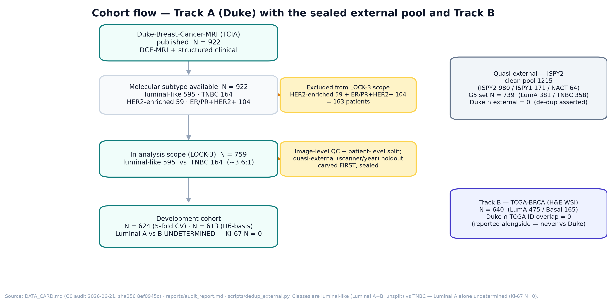
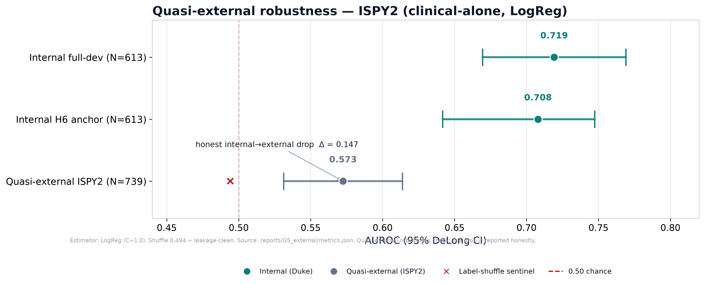
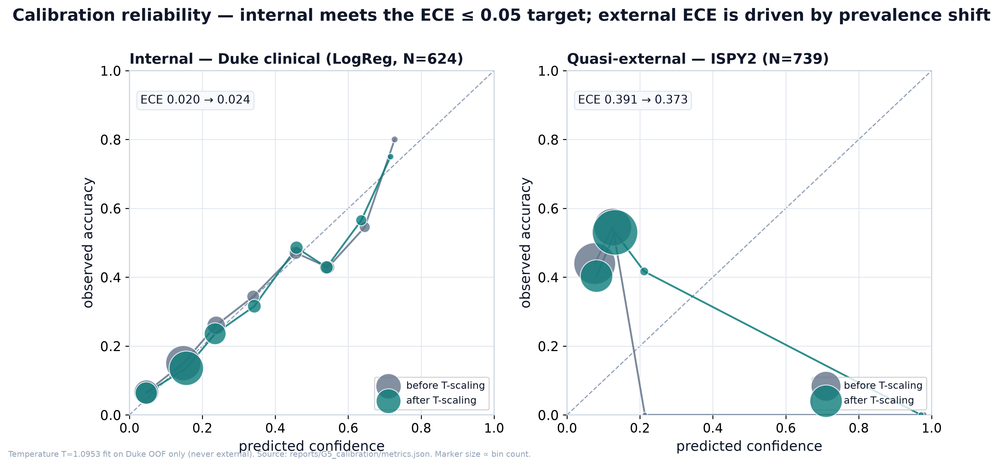
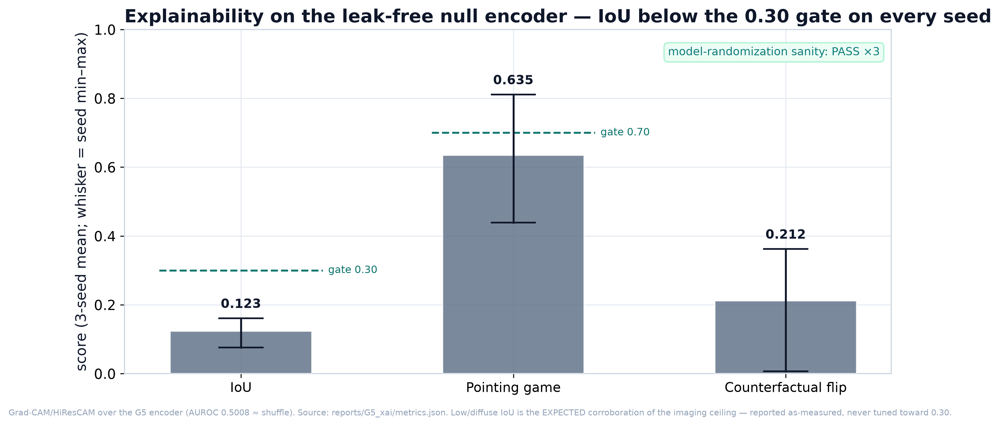
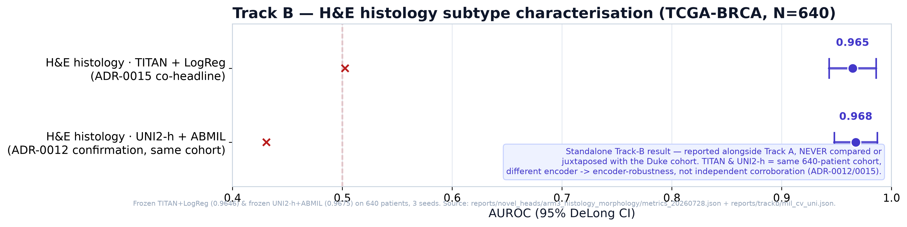

<!-- PinkSight — OPSI 2026 manuscript (IMRaD, TRIPOD+AI). Authority: decisions.md + CLAIM LEDGER.
     STATUS 2026-08-12: full body drafted + 7-agent QA pass applied (numeric, ledger, TRIPOD+AI, citations,
     methods-rigour, framing, red-team). Fixes folded: C1 Track-B 0.9675 restored (ADR-0012 ratified 2026-08-12);
     C2 external feature-parity (4/9) corrected; H1-H3 paired-anchor + "not demonstrated"
     reframe; Li-2016 (0.89=ER-status, subtype ~0.67); Track-B relabelled Luminal A vs basal.
     Pending: embed Fig 2-8 + Table 1-2 at their callouts; resolve blocker B1 (cohort label) before the title is
     final; run per-subgroup fairness analysis (TRIPOD item 14); final /red-team (P15) before submission.
     Every number traces to reports/paper/tables/Table2_results.md + its source JSON. Ledger-lint gated. -->

# PinkSight: leakage-controlled multimodal fusion for breast-cancer subtype characterisation at diagnosis — a characterised imaging-information ceiling with a standalone histology co-analysis

*Team TestEin (Richard Amadeus, Nathania Audrey Marpaung). OPSI 2026. Research study — not a clinical tool.*

> **Cohort-label note (unresolved — blocker B1):** the operative positive-class contrast is **luminal-like
> (Luminal A + B, unsplit) vs TNBC**; a Luminal-A-only contrast is undetermined because Ki-67 is absent
> (N=0). The title and all text use "luminal-like vs TNBC". Do not substitute "Luminal A" without resolving B1.

## Abstract

**Background.** Multimodal fusion is widely proposed to improve non-invasive breast-cancer subtype
characterisation, but reported gains are often single-cohort, rarely externally validated, and vulnerable to
label leakage. We tested, under a pre-registered and leakage-controlled protocol, whether fusion improves on the
best single modality for characterising subtype (luminal-like vs TNBC) at diagnosis.

**Methods.** Retrospective, multi-cohort study reported to TRIPOD+AI. On the Duke DCE-MRI + clinical cohort
(development N=624; luminal-like vs TNBC) we evaluated a six-rung ablation ladder — radiomics, clinical-alone,
unimodal MRI, flat fusion, hierarchical late-clinical cross-attention fusion, and a biology-gated
mixture-of-experts — with strictly patient-level splits, three seeds, and a sealed quasi-external cohort (ISPY2,
N=739). The pre-registered primary outcome was ΔAUROC (fusion − best single modality) with a ≥ 0.03 margin by
paired DeLong. Subtype-defining biomarkers were excluded from all inputs (asserted in CI). We report AUROC with
95% DeLong CIs, expected calibration error, label-shuffle sentinels, and box-level saliency. A standalone H&E
histology co-analysis on TCGA-BRCA (N=640) is reported alongside.

**Results.** Clinical data alone was the only modality with clinically meaningful discrimination (logistic
regression AUROC 0.708, 95% CI 0.642–0.747, N=613; internal ECE 0.020; shuffle 0.505); the learned MRI encoder
was at chance (0.518, 0.462–0.575) and radiomics only weakly above it (0.567, 0.510–0.624). Every fusion rung
was below the clinical anchor — flat fusion 0.636 (0.580–0.692; Δ −0.072), biology-gated
mixture-of-experts reported as a hash-salt distribution 0.650 ± 0.018 (all 20/20 draws below 0.708), and hierarchical fusion 0.599 (3-seed mean; representative single-seed [seed-0] CI 0.495–0.610, crosses 0.50; Δ −0.109);
per-sample probabilities were retained only for an estimator-matched within-pipeline check (flat fusion vs an
estimator-matched clinical model, paired ΔAUROC −0.0026, p = 0.98, 95% CI −0.048 to +0.042). Because that
interval still includes the pre-registered +0.03 margin, the fusion improvement was **not demonstrated** (and the
study is underpowered to exclude it), rather than positively rejected. On a genuinely external cohort (ISPY2,
N=739) the clinical model reached 0.5725 (0.531–0.614), an honest drop of 0.147 from the full-development internal
0.719, driven by both a 48%→21% TNBC prevalence shift and the availability of only four of nine clinical features;
internal calibration met target (ECE 0.020 pre-scaling) and saliency on the imaging encoder gave a box-IoU of
0.123 ± 0.035 (below the 0.30 target on all seeds; randomization sanity passed), corroborating the ceiling. On a
separate TCGA-BRCA H&E cohort (Luminal A vs basal-like, N=640, patient-level, leave-one-site-out 0.968),
standalone histology characterised subtype at AUROC 0.9646 (0.9432–0.9859) — reported alongside and not compared
with the Duke cohort.

**Conclusions.** On this cohort, imaging adds no subtype signal separable from clinical data — a characterised
information ceiling, not an under-powered result. The contribution is a leakage-safe fusion architecture (with a
routing pathway caught and rejected as leakage) and an honest, externally validated, explainable characterisation.
This is a research study, not a clinical tool.

## 1. Introduction

Breast cancer is the most commonly diagnosed cancer in women, and in Indonesia and across the wider ASEAN region
a large share of patients present with late-stage disease, and diagnostic delays after a symptom or finding are
well documented (Lim 2022; Hutajulu 2022); AI adoption across the region's cancer programmes remains limited
(Tun 2025). Once a suspicious lesion has been identified, accurate and minimally invasive characterisation of
its molecular subtype at the moment of diagnosis — in particular distinguishing generally more-indolent,
hormone-receptor-positive luminal-like disease from aggressive triple-negative breast cancer (TNBC) — informs
prognosis and management. Molecular subtype is routinely established by immunohistochemistry, but there is
strong interest in inferring it from data already acquired in the diagnostic pathway.

Multimodal deep-learning fusion, which combines imaging, structured clinical data, and where available
histopathology and genomics, has been proposed as a way to improve on any single modality (Lipkova 2022;
Waqas 2024). Models fusing imaging with clinical information have reported gains, often for adjacent tasks such
as post-diagnosis recurrence prognostication from histopathology (Witowski 2024). MRI-radiomics has reported
strong receptor-status discrimination (ER± up to AUC ≈ 0.89) but only modest molecular-subtype discrimination on
the same data (triple-negative vs others ≈ 0.67) (Li 2016). Histopathology likewise encodes molecular subtype,
with deep-learning models predicting intrinsic subtype from routine H&E slides (Couture 2018).

Two problems temper these reports. First, performance is frequently established on a single cohort and rarely
validated on held-out external data: a scoping review found that only 14% of whole-slide-image studies used
external validation, and flagged selection bias in the most widely used public cohort (Tafavvoghi 2024). Second,
apparent fusion gains are vulnerable to label leakage whenever the biomarkers that *define* the subtype label
(ER, PR, HER2, Ki-67) reach the model as inputs. Leakage-controlled, externally validated, and calibrated
evaluation is therefore a prerequisite before any fusion improvement can be believed.

PinkSight is a leakage-controlled, pre-registered study of multimodal fusion for subtype characterisation
(luminal-like vs TNBC) of already-identified lesions at diagnosis. The pre-registered primary hypothesis is
that cross-attention fusion improves subtype AUROC over the best single modality by a meaningful margin
(ΔAUROC ≥ 0.03; §2.7). We evaluate it on the Duke DCE-MRI + clinical cohort with strictly patient-level splits
and a sealed quasi-external cohort, report every number with its DeLong confidence interval, calibration, and
across-seed spread, validate saliency against the region of interest, and report the outcome honestly whether
or not it supports the hypothesis. The contributions are: (i) a leakage-safe hierarchical late-clinical
cross-attention fusion architecture with a biology-gated mixture-of-experts, including a routing pathway that
was caught and rejected as a leakage vector; (ii) a characterised information ceiling for imaging-based subtype
characterisation on this cohort — corroborated by explainability and consistent with an honestly-dropping
external clinical result, reported as a finding rather than buried; and (iii) a standalone H&E-histology subtype
co-analysis reported alongside.

---

## 2. Methods

### 2.1 Study design and reporting
PinkSight is a retrospective, multi-cohort modelling study reported to the TRIPOD+AI guideline. It is a research
study, not a clinical or screening tool. The analysis plan was pre-registered and frozen before results were
seen (`docs/pre_registration.md`); the pre-specified primary outcome, statistical tests, and halt rules are
stated in §2.7 and §2.9, and any deviation is logged. Throughout, null findings are reported with the same
prominence a positive result would have received.

The task is **subtype characterisation of already-identified, confirmed-cancer lesions at diagnosis**: a binary
contrast of **luminal-like (Luminal A + B) vs triple-negative breast cancer (TNBC)**, with TNBC as the
minority positive class. Molecular subtype is used only as the label; the immunohistochemistry that defines it
(ER, PR, HER2, Ki-67, molecular-subtype call, Oncotype) is never a model input (§2.4). Ki-67 is reported
descriptively only, because no usable numeric Ki-67 value exists in the source clinical tables (N=0); no Ki-67
regression head and no tumour-grade head are trained.

### 2.2 Data sources and cohorts
Five cohorts are used (Table 1; cohort flow in Fig 2).

- **Track A — Duke-Breast-Cancer-MRI** (TCIA; the headline cohort): pre-operative dynamic contrast-enhanced MRI
  (DCE-MRI; pre- and post-contrast phases) plus a structured clinical table, single-institution.
- **Quasi-external — ISPY2**: a sealed external clinical cohort used only at the end for a robustness check.
- **Track B — TCGA-BRCA**: H&E whole-slide images, used for a standalone histology co-analysis.
- **Companion cohorts**: ISPY2/MAMA-MIA (pathological-complete-response pilot) and fastMRI-NYU (a standalone
  DCE-MRI encoder) — each analysed independently, with no pooling and no cross-cohort claim.

<!-- Table 1 — source of truth: reports/paper/tables/Table1_cohorts.md (keep in sync) -->
**Table 1. Cohorts and datasets.** Classes are luminal-like (Luminal A+B, unsplit) vs TNBC; Luminal A alone is
undetermined (Ki-67 N=0). Cohort facts verified against `DATA_CARD.md` (G0 audit, sha256 `8ef0945c`) and `decisions.md`.

| Cohort | Role | Modality | N (analysis) | Class balance | Source | Split | Key notes |
|---|---|---|---|---|---|---|---|
| **Duke-Breast-Cancer-MRI** | Track A — headline | DCE-MRI + structured clinical | 759 in-scope; dev **624** (5-fold CV) / **613** (MRI+clinical bi-modal) | luminal-like 595 / TNBC 164 (~3.6:1) | TCIA, single-institution | patient-level 5-fold; quasi-external (scanner/year) holdout carved **first** | one 3D bounding box/patient (not pixel masks); demographically skewed; Ki-67 absent → descriptive-only; Luminal A vs B undetermined |
| **ISPY2** | Quasi-external (G5) | structured clinical | **739** balanced (from clean pool 1215) | LumA 381 / TNBC 358 (~48% TNBC) | multi-site trial, via MAMA-MIA pool | sealed external; Duke ∩ external = 0 (de-dup asserted) | 48%→21% TNBC prevalence shift drives external ECE; LogReg estimator |
| **TCGA-BRCA** | Track B — co-result | H&E whole-slide (+ genomics) | **640** | LumA 475 / Basal 165 (~2.9:1) | TCGA | patient-level, 3 seeds; LOSO robustness | frozen TITAN / UNI2-h encoders; Duke ∩ TCGA ID overlap = 0; reported alongside Track A, never juxtaposed |
| **ISPY2 / MAMA-MIA (pCR)** | Pilot (ADR-0007) | DCE-MRI radiomics | **980** | pCR prevalence 0.322 | ISPY2 | patient-level, 3 seeds | distinct cohort from Duke; both gates NO-GO; no cross-cohort claim |
| **fastMRI-NYU** | Standalone (ADR-0016) | DCE-MRI | 300 (199 train / 50 test) | malignant 90 / benign 159 / normal 51 (quarantined) | NYU fastMRI Breast | shipped split 240/60 | NYU-only, never juxtaposed with Duke; H-char AUROC 0.599 NO-GO; anomaly head not trained |

*Leakage controls (all cohorts, LOCK-2): patient-level sealed splits; the FORBIDDEN set {ER, PR, HER2, Ki-67,
molecular-subtype, Oncotype} ∩ classifier inputs = ∅ (CI-asserted); preprocessing (Nyúl landmarks, scalers,
imputers) fit on the train fold only; Duke ∩ MAMA-MIA = 291 shared patients dropped before any external claim.*

### 2.3 Participants and eligibility (Fig 2)
Of 922 published Duke patients with DCE-MRI and clinical labels, 759 fall in the analysis scope (luminal-like
595, TNBC 164; ~3.6:1); 163 patients of other molecular subtypes (HER2-enriched 59; ER/PR-positive HER2-positive
104) are excluded. After image-level quality control and the patient-level split (§2.5), the development cohort
is N=624 (five-fold cross-validation); N=613 is the full MRI+clinical (bi-modal) intersection of that cohort (patients with all
modalities present — not a label-selected sub-sample), used for the estimator-matched anchor analyses. The
Luminal A vs B distinction within luminal-like is not made (it requires Ki-67, which is absent).

**Figure 2. Cohort flow — Track A (Duke), the sealed external pool, and Track B.** Duke 922 → 759 in-scope
(luminal-like 595 vs TNBC 164) → development N=624 (5-fold CV) / N=613 (MRI+clinical bi-modal intersection). Classes are
luminal-like (A+B) vs TNBC; Luminal A alone undetermined (Ki-67 N=0). Sealed external pool 1215 (ISPY2 set
N=739, Duke∩external=0). Track B TCGA-BRCA N=640, reported alongside, never juxtaposed with Duke.

### 2.4 Predictors and leakage control
Clinical predictors are nine leakage-safe fields: tumour size (T stage), nodal status (N stage), Nottingham
grade, age at diagnosis, menopausal status, race/ethnicity, multicentric/multifocal status,
metastatic-at-presentation status, and lymphadenopathy. Of these, only four (age, menopausal status,
race/ethnicity, multifocality) are natively present in the external ISPY2 cohort; the remaining five — including
Nottingham grade, the model's strongest single predictor — are absent there and imputed from Duke training
statistics (§3.5). The **forbidden set** — the biomarkers that define the subtype label (ER, PR, HER2, Ki-67),
together with the molecular-subtype call and Oncotype — is excluded from every classifier input, and this
exclusion is asserted in continuous integration (LOCK-2). Imaging predictors
are DCE-MRI phase volumes cropped to the region of interest. The executed pipeline uses the region of interest
that Duke provides — one 3-D bounding box per patient (`Annotation_Boxes.xlsx`) — not a trained segmenter; a
learned H0 segmentation front-end (MAMA-MIA nnU-Net) is intended future work and was not used for the results
below. All preprocessing statistics (Nyúl intensity landmarks, feature scalers, imputers) are fit on the
training fold only.

### 2.5 Splits, sample size, and de-duplication
Splits are strictly patient-level (never image- or slice-level). Within Duke, a scanner/year quasi-external
holdout was carved first and sealed as a leakage check; the remainder was split by five-fold stratified
cross-validation over three random seeds. The primary external evaluation, however, uses a genuinely different
cohort — ISPY2 (§2.10): before any external analysis the 291 patients shared between Duke and the MAMA-MIA pool
were removed, leaving a clean external pool of 1,215 (of which the balanced ISPY2 set of 739 is used); the
post-de-duplication Duke∩external overlap is 0 (asserted). The pre-registered power calculation targets 80%
power at α=0.05 to detect a fusion improvement of ΔAUROC=0.05; where N does not support a comparison, the minimum
detectable effect is reported (§3.2) and the finding framed accordingly.

### 2.6 Model architecture
The intended multimodal pipeline is: region-of-interest hand-off → a 3-D convolutional MRI encoder
(3D-ResNet-18 initialised from MedicalNet) → fused with a clinical-tabular encoder (FT-Transformer) through a
**leakage-safe hierarchical late-clinical cross-attention fusion**, with a **biology-gated mixture-of-experts
(MoE)** routing layer, feeding a single subtype-characterisation head. The MoE router uses tumour-grade bands;
a hormone-receptor-status router was tested and **rejected as a leakage pathway** (it produced a degenerate
1.0 AUROC) — this rejection is itself a reported methods finding. The model has one head; there is no
tumour-grade head and no Ki-67 head.

### 2.7 Primary analysis — the ablation ladder
The pre-registered primary outcome is **ΔAUROC = AUROC(fusion) − AUROC(best single modality)**, with a
pre-specified meaningful margin of **≥ 0.03** and significance by paired DeLong. This is evaluated across a
six-rung ablation ladder on the Duke development cohort (Fig 3, Table 2): (1) radiomics floor, (2) clinical-alone,
(3) unimodal MRI, (4) flat fusion, (5) hierarchical fusion, (6) biology-gated MoE. The clinical-alone rung is
the anchor the fusion rungs must beat.

### 2.8 Explainability
Saliency was computed with Grad-CAM/HiResCAM (plus SHAP for the tabular stream and cross-attention weights),
scored against the provided per-patient bounding box as box-IoU and a pointing-game hit rate, and subjected to
a model-parameter randomization sanity check (saliency must degrade when the encoder is randomized). Because the
region of interest is a bounding box rather than a pixel mask, IoU is box-IoU.

### 2.9 Statistical analysis
Discrimination is reported as AUROC with a 95% DeLong confidence interval. For rungs with three retained per-seed
CIs the reported interval is the mean of the per-seed DeLong CIs. The hierarchical and mixture-of-experts rungs did
not retain per-sample out-of-fold probabilities in the original G3 run; a subsequent frozen-embedding reproduction
(deterministic md5 router, no encoder re-run) re-generated them in this integrity pass, so these rungs now carry a
representative single-seed (seed-0) DeLong CI — the headline uncertainty, which for hierarchical #4 crosses 0.50
— and a secondary, variance-reduced pooled-OOF ensemble CI (a single DeLong CI over the three-seed
per-patient-mean out-of-fold predictions), with the point estimate reported as the three-seed mean and the
across-seed SD given. Paired DeLong is consequently available for the fusion rungs and is reported alongside the
descriptive point-estimate deltas (§3.2); it remains negative — fusion below clinical. A label-shuffle sentinel accompanies each rung for which it was computed
(clinical, flat fusion, hierarchical, and the external model), with a pre-registered halt rule if the
shuffled-label AUROC exceeds 0.60 (a leakage signal). Calibration is reported as expected calibration error (ECE)
over eight equal-width bins, with temperature scaling fit on Duke out-of-fold predictions only. Every model is run over three seeds and the across-seed spread is
reported; the estimator is always named alongside the number, because the same features yield 0.708 under
logistic regression and 0.634 under an FT-Transformer — the gap is the estimator, not leakage.

### 2.10 External validation and calibration
The sealed ISPY2 clinical cohort (N=739) was scored once, at the end, with the frozen Duke logistic-regression
model. Because only four of the nine clinical features are natively present in ISPY2 (§2.4), this is a robustness
check of a feature-reduced model rather than a like-for-like external test; we report the internal→external AUROC
drop, the feature parity, and the external ECE per cohort. The temperature scaling was fit on Duke data only and
never on the external set.

### 2.11 Track B — histology co-analysis (reported alongside, firewalled)
On TCGA-BRCA H&E whole-slide images (N=640; PAM50 Luminal A 475 / basal-like 165 — a Luminal-A-vs-basal contrast,
distinct from Track A's luminal-like-vs-TNBC), subtype was characterised from frozen self-supervised slide
features (TITAN with a logistic-regression head) over three seeds with leave-one-site-out robustness. The
Duke∩TCGA patient-identifier overlap is 0 by construction (the two datasets use disjoint ID namespaces); no
clinical crosswalk exists, so this is necessary but not sufficient for a no-shared-patient guarantee. Per
ADR-0015, Track B results are reported **alongside** Track A and are never compared or juxtaposed with the Duke
cohort.

### 2.12 Companion analyses
Three companion analyses are reported, each on a distinct cohort with its own pre-specified gate and no
cross-cohort claim: a pathological-complete-response (pCR) pilot on ISPY2/MAMA-MIA (N=980); an at-diagnosis
recurrence-risk *stratification* organ on Duke baseline features (ADR-0006, Duke-only); and a standalone
fastMRI-NYU DCE-MRI encoder (ADR-0016, NYU-only). A Track-C ensemble of independent public tabular-risk cohorts
is reported as separate per-cohort benchmarks (not fusion).

### 2.13 Software and reproducibility
Models were built in PyTorch with MONAI for MRI preprocessing (N4 bias-field correction, 1 mm isotropic
resampling, Nyúl normalization). Configurations and splits are frozen; leakage assertions and a claim-ledger
lint run in continuous integration. Every figure and table in this paper is regenerated from a stored result
artifact by `scripts/make_paper_figures.py` and the table sources — no figure is drawn by hand.

---

## 3. Results

### 3.1 Participants
The cohort flow is shown in Fig 2 and cohort characteristics in Table 1. The Duke development cohort is N=624
(five-fold CV), with an N=613 MRI+clinical (bi-modal) intersection for the estimator-matched anchor analyses, luminal-like vs
TNBC; the sealed ISPY2 external set is N=739 (48% TNBC, versus 21% in Duke); the Track B TCGA-BRCA cohort is
N=640 (Luminal A vs basal-like).

### 3.2 Primary outcome: fusion does not improve on the clinical anchor (Fig 3, Table 2)
On the Duke development cohort, **clinical data alone is the only modality with clinically meaningful
discrimination**: logistic regression on the nine clinical features reaches **AUROC 0.708 (95% DeLong CI
0.642–0.747; N=613)**, with an internal ECE of 0.0196 and a label-shuffle sentinel at 0.505 (chance). **Every
imaging-involving rung falls below this anchor.** The pre-registered primary contrast — ΔAUROC of each fusion
rung against the best single modality (clinical, 0.708) — is negative for all three rungs. Per-sample
out-of-fold probabilities have now been retained for the fusion rungs, so the paired DeLong test against the
clinical anchor is available on the aligned N=613 subset (patient-level; per-patient label agreement asserted):
hierarchical #4 mean ΔAUROC −0.130 and biology-gated MoE #7 mean ΔAUROC −0.075 are each paired-significantly
below the anchor (Stouffer-combined p ≪ 0.001 across three seeds), and flat fusion is indistinguishable from an
estimator-matched clinical model (Δ −0.0026, p = 0.98). Flat fusion reaches 0.636 (0.580–0.692; descriptive Δ
−0.072); the biology-gated MoE is reported as a 20-salt distribution 0.650 ± 0.018 (range 0.615–0.689, all
20/20 draws below the 0.708 anchor; md5-deterministic instance 0.6542; descriptive Δ −0.058); and hierarchical
fusion 0.599 (three-seed mean; representative single-seed [seed-0] CI 0.495–0.610, crosses 0.50; secondary
pooled-OOF ensemble CI 0.6365 [0.582, 0.691]; across-seed SD 0.041; descriptive Δ −0.109). The one genuine paired test available is a within-pipeline check against the
estimator/feature-matched clinical model (~0.638, **not** the 0.708 anchor of record), against which flat fusion
is statistically indistinguishable (ΔAUROC −0.0026; paired DeLong p = 0.98; bootstrap 95% CI −0.048 to +0.042).
Because that interval still contains the pre-registered +0.03 margin, the study **did not demonstrate the
pre-registered fusion improvement and is underpowered to exclude it** (minimum detectable effect ≈ ±0.045 on the
estimator-matched leg; ≈ 0.066–0.073 on the direct fusion-vs-0.708-anchor leg at N=613 — ≈ 2× the +0.03 margin,
needing ≈ 2,900–3,600 patients to detect it); no rung reaches the pre-registered 0.75 subtype-AUROC floor. The conclusion of no separable imaging
contribution therefore rests on the convergence of evidence below — imaging at chance, explainability null,
shuffles at chance — not on a single paired test.

**Figure 3. Ablation ladder — subtype characterisation (Duke, headline).** Every imaging-involving rung falls
below the clinical-alone anchor (LogReg, 0.708). Flat fusion vs the estimator-matched clinical model: paired
DeLong Δ = −0.0026, p = 0.98 vs the estimator-matched clinical model (CI includes the +0.03 margin → not
demonstrated); hierarchical #4 paired Δ vs the 0.708 anchor = −0.130, p ≪ 0.001. The result is a characterised information ceiling, not an under-powered run.

<!-- Table 2 — source of truth: reports/paper/tables/Table2_results.md (keep in sync). The Track-B
     MIL (UNI2-h/ABMIL) row is included below, ratified per ADR-0012 (2026-08-12). -->
**Table 2. Results matrix (all reportable numbers).** Every AUROC carries its 95% DeLong CI; the estimator is
always named (0.708 = LogReg, not the FT-Transformer's 0.634). `†` = pooled-OOF ensemble CI (3-seed per-patient-mean OOF, one DeLong CI), reported as a secondary variance-reduced estimator (not the headline); #4's headline uncertainty is the representative single-seed (ci_seed=0) CI, which crosses 0.50. Track B is reported alongside Track A and is never compared or juxtaposed with the Duke cohort (ADR-0015).

*Track A — Duke subtype characterisation (luminal-like vs TNBC; N=613; patient-level 5-fold OOF; 3 seeds)*

| Result | Estimator | AUROC [95% DeLong CI] | ECE | Shuffle | Verdict | Source |
|---|---|---|---|---|---|---|
| Radiomics floor (G1) | LogReg (107 feat) | 0.567 [0.510, 0.624] | 0.068 | — | LOCK-4 floor | `G1_baseline/metrics.json` |
| **Clinical-alone (anchor)** | **LogReg (C=1.0)** | **0.708 [0.642, 0.747]** | 0.0196 | 0.505 | **only modality with meaningful discrimination** | `ablation_table.json` · `G5_external.json` · `G5_calibration.json` |
| Unimodal MRI | 3D-ResNet-18 + probe | 0.518 [0.462, 0.575] | — | — | null | `G3/ablation_table.json` |
| Flat fusion | concat cross-attn | 0.636 [0.580, 0.692] | 0.253 | 0.503 | null — descriptive Δ vs 0.708 = −0.072; paired Δ vs estimator-matched clinical (~0.638) = −0.0026, p = 0.98 (CI incl. +0.03 → not demonstrated) | `G3/delong_deltas.json` |
| Hierarchical fusion #4 | staged late-clinical | 0.599 (3-seed mean, SD 0.041; representative single-seed [seed-0] CI 0.495–0.610, crosses 0.50); secondary pooled-OOF ensemble 0.6365 [0.582, 0.691]† | — | 0.494 | null — descriptive Δ vs clinical = −0.109; paired DeLong Δ vs 0.708 = −0.130 (p ≪ 0.001) | `G3/hierarchical_oof.json` |
| Biology-gated MoE #7 | grade-band routing | 0.650 ± 0.018 [0.615, 0.689] (20-salt sweep; all 20/20 < 0.708; md5-det 0.6542; pooled-OOF 0.6682 [0.613, 0.723]†) | — | — | null (< clinical); paired DeLong Δ vs 0.708 = −0.075 (p ≪ 0.001); expert class-purity e0 0.876±0.015 / e1 0.717±0.012 (routing purity, not a per-expert AUROC) | `G3/moe7_corrected_reporting.json` · `G3/moe_salt_sweep/` |
| Imaging closing arm (G2) | 3D-ResNet-18 corrected | 0.491 [0.395, 0.587] (N≈200 smoke) | — | 0.490 | null (6-axis independent) | `G2/run_r18_mn_corrected_smoke` |

*Track A — quasi-external, calibration, explainability (G5)*

| Result | Estimator | Value [95% CI] | Notes | Verdict | Source |
|---|---|---|---|---|---|
| ISPY2 quasi-external | LogReg | AUROC 0.5725 [0.531, 0.614] | internal 0.719; honest drop Δ = 0.147; shuffle 0.494 | real-but-weak (CI LB > 0.50) | `G5_external/metrics.json` |
| Calibration — internal | LogReg | ECE 0.0196 → 0.0244 (T=1.095) | meets ≤ 0.05 "good" target | pass | `G5_calibration/metrics.json` |
| Calibration — external | LogReg | ECE 0.391 → 0.373 | prevalence-shift driven, not leakage | target not met externally | `G5_calibration/metrics.json` |
| XAI IoU (null encoder) | Grad-CAM/HiResCAM | 0.123 ± 0.035 (3-seed) | < 0.30 gate on all seeds; encoder AUROC 0.5008 | honest-null corroboration | `G5_xai/metrics.json` |
| XAI pointing game | Grad-CAM/HiResCAM | 0.635 (3-seed mean) | < 0.70 gate; randomization sanity PASS ×3 | honest-null corroboration | `G5_xai/metrics.json` |

*Track B — H&E histology subtype characterisation (TCGA-BRCA; Luminal A vs basal-like; N=640) — reported alongside, firewalled*

| Result | Estimator | AUROC [95% DeLong CI] | ECE | Shuffle | Verdict | Source |
|---|---|---|---|---|---|---|
| **arm-3 histology (co-headline)** | frozen TITAN + LogReg | **0.9646 [0.943, 0.986]** | 0.042 | 0.503 | RATIFIED co-headline (ADR-0015); LOSO 0.9679 | `arm3/metrics_20260728.json` |
| Track B MIL (confirmation) | frozen UNI2-h + ABMIL | 0.9675 [0.9479, 0.9871] (3-seed 0.9622 ± 0.0038) | 0.0428 | 0.4309 | RATIFIED (ADR-0012) — reported alongside arm-3; **same 640-patient cohort, different encoder (UNI2-h vs TITAN) → encoder-robustness, NOT independent corroboration**; never juxtaposed with Duke | `trackb/mil_cv_uni.json` |

*Companions and pilots (distinct cohorts; no cross-cohort claim)*

| Result | Cohort (N) | Value [95% CI] | Shuffle | Verdict | Source |
|---|---|---|---|---|---|
| pCR Phase D — radiomics floor | ISPY2/MAMA-MIA (980) | AUROC 0.599 [0.561, 0.637] | 0.498 | NO-GO (gate 0.65) | `pcr_pilot/metrics_floor.json` |
| pCR Phase E — 3D-CNN | ISPY2/MAMA-MIA (980) | AUROC 0.4874 (per-seed CIs cross 0.50) | 0.502 | genuine null, NO-GO (gate 0.62) | `pcr_pilot/metrics_cnn.json` |
| At-diagnosis recurrence stratification (ADR-0006) | Duke (920) | AUROC 0.577 [0.482, 0.614] | 0.468 | disclosed near-null; ECE 0.256 → 0.007 | `decisions.md` |
| Track-C ensemble panel | Coimbra 116 / BCSC 2.39M / METABRIC 1917 | 0.806 [0.724, 0.887] / 0.634 [0.625, 0.642] / 0.744 [0.717, 0.771] | — | independent per-cohort benchmarks (ensemble, not fusion) | `decisions.md` |
| fastMRI-NYU H-char (standalone) | NYU (249) | AUROC 0.599 [0.430, 0.768] | 0.370 | NO-GO; NYU-only, never vs Duke | `decisions.md` |

*The Track-B MIL arm (frozen UNI2-h + ABMIL) is now logged and ratified (ADR-0012, 2026-08-12) and is reported in
the Track B block above, alongside arm-3 on the same 640-patient cohort with a different encoder →
encoder-robustness, not independent corroboration, never juxtaposed with Duke. The fastMRI-NYU H-char 0.599
coinciding with the Duke hierarchical-#4 0.599 is pure coincidence across distinct cohorts and tasks — never a
comparison.*

### 3.3 Imaging alone carries no separable subtype signal
The learned unimodal MRI encoder is at chance (AUROC 0.518, 95% CI 0.462–0.575, the interval including 0.50);
radiomics is weakly but significantly above chance (0.567, 0.510–0.624; the LOCK-4 reference) yet far below
clinical. A smaller-scale corrected-recipe arm (N≈200; wide CI 0.395–0.587) reached 0.491 with a label-shuffle
AUROC of 0.490 — real performance indistinguishable from chance — corroborating the null at wiring scale. The
imaging null therefore holds across radiomics, learned encoders, and multiple optimisation axes. This is a
**characterised information ceiling on the Duke cohort — the imaging modality carries no subtype signal separable
from clinical data here — and not an under-powered result**: the N=613 MRI+clinical (bi-modal) intersection is the full
available cohort (not a label-selected sub-sample), and the functioning clinical anchor on the same patients
rules out a broken pipeline.

### 3.4 The fusion architecture as a methods contribution
Although fusion does not raise discrimination on Duke, the architecture yields a reusable, leakage-safe design:
a hierarchical late-clinical cross-attention fusion with a biology-gated MoE. The hormone-receptor-status router
was **caught and rejected as a leakage pathway** (degenerate 1.0 AUROC) in favour of grade-band routing, whose
experts partition the label without leaking it (expert-0 class-purity 0.875 and expert-1 0.712, the latter still
enriching TNBC from the ~0.21 base rate to 0.29). The value of this rung is the leakage-safe construction, not a
performance gain.

### 3.5 Quasi-external robustness (Fig 6)
On the sealed ISPY2 cohort, the frozen Duke clinical model reaches **AUROC 0.5725 (0.5312–0.6137)** — weak but
above chance (lower bound > 0.50), with a label-shuffle sentinel at 0.494. Against the internal full-development
AUROC of 0.7192 (0.670–0.769; N=624), this is a drop of ΔAUROC = 0.147, which exceeds the pre-registered
acceptable quasi-external drop of ≤ 0.10. The drop is attributable to two factors, not one: a feature-parity
collapse — only four of the nine clinical features (age, menopausal status, race, multifocality) are natively
present in ISPY2, so Nottingham grade (the model's strongest predictor; dropping it alone reduces the internal
model to 0.512) and the staging/nodal fields are imputed from Duke statistics — and the 48%→21% TNBC prevalence
shift. It is therefore reported as a per-cohort robustness check of a feature-reduced model, not a like-for-like
external validation.

**Figure 6. Quasi-external validation on ISPY2.** External AUROC 0.5725 [0.531, 0.614] vs internal 0.719; honest
drop Δ = 0.147. Real-but-weak (CI lower bound > 0.50); the label-shuffle sentinel at chance confirms the result
is leakage-clean.

### 3.6 Calibration (Fig 5)
The internal Duke clinical model is natively well calibrated: **ECE 0.0196 before any post-hoc scaling** (over
eight equal-width bins), meeting the ≤ 0.05 "good" target. In a three-way re-fit, neither temperature scaling
(T = 1.095, ECE 0.0244) nor held-out (leakage-free) isotonic regression (ECE 0.0376) improves on the raw
predictions, so the best method is **none** and no post-hoc scaling is applied internally. On
ISPY2 the external ECE is 0.39 and is not materially improved by temperature scaling (0.373); this reflects the
48% vs 21% TNBC prevalence shift between cohorts, compounded by the feature-parity collapse (§3.5), rather than a
leakage artifact.

**Figure 5. Calibration reliability — internal vs quasi-external.** The internal Duke clinical model is well
calibrated (ECE 0.0196); the external ISPY2 ECE (0.39) reflects the 48% vs 21% TNBC prevalence shift, not
leakage. Temperature scaling was fit on Duke out-of-fold predictions only.

### 3.7 Explainability corroborates the ceiling (Fig 7)
Saliency on the trained imaging encoder (whose AUROC of 0.5008 is itself at chance) gives a box-IoU of
**0.123 ± 0.035** across three seeds — below the 0.30 gate on every seed. The pointing-game score is more variable
(three-seed mean 0.635; per-seed 0.44 / 0.65 / 0.81, straddling the 0.70 gate) and the counterfactual-flip rate
likewise unstable (0.27 / 0.36 / 0.01); the model-randomization sanity check passes on all three seeds. A low, diffuse
saliency map is the **expected corroboration of the imaging-information ceiling**, and is reported as measured,
not tuned toward the target.

**Figure 7. XAI faithfulness on the null encoder.** Box-IoU 0.123 ± 0.035 (< 0.30 gate on all three seeds),
pointing-game 0.635, counterfactual-flip 0.212; model-randomization sanity PASS ×3. On a leak-free null encoder
(AUROC 0.5008), low IoU is the expected corroboration of the Duke imaging→subtype ceiling.

### 3.8 Track B: histology carries strong standalone subtype signal (Fig 8) — reported alongside
On TCGA-BRCA H&E whole-slide images (Luminal A vs basal-like, N=640), subtype characterisation from frozen slide
features reaches **AUROC 0.9646 (0.9432–0.9859)** (TITAN + logistic regression; ECE 0.042; label-shuffle 0.503;
leave-one-site-out 0.9679, indicating the signal is not a site confound). This standalone Track B result is
reported alongside Track A and is not compared or juxtaposed with the Duke cohort (ADR-0015). A confirmation arm
using a **different frozen foundation encoder (UNI2-h) with attention-based MIL** reaches **AUROC 0.9675
(0.9479–0.9871; 3-seed 0.9622 ± 0.0038; ECE 0.043; label-shuffle 0.431)** on the **same 640 TCGA-BRCA patients** —
establishing that the histology subtype signal is **encoder-robust** (TITAN and UNI2-h agree), not an artefact of
one encoder. Because arm-3 and this MIL arm share the same cohort, they are reported as **encoder-robustness on
one cohort, never as two independent-cohort results**, and neither is compared or juxtaposed with the Duke cohort
(ADR-0012 / ADR-0015 firewall).

**Figure 8. Track B histology — TCGA-BRCA (firewalled, own axes).** TITAN + LogReg 0.9646 [0.943, 0.986]
(ADR-0015 co-headline), 3 seeds, LOSO 0.9679. Reported alongside Track A and never juxtaposed with the Duke
null. UNI2-h/ABMIL confirmation arm 0.9675 [0.9479, 0.9871] (ADR-0012; same 640-patient cohort, different
encoder → encoder-robustness, not independent corroboration; never juxtaposed with Duke).

### 3.9 Companion analyses (Table 2)
The pCR pilot on ISPY2/MAMA-MIA is NO-GO on both pre-specified gates: a radiomics floor of AUROC 0.599
(0.561–0.637; gate 0.65) and a 3-D CNN of 0.4874 (per-seed DeLong CIs all crossing 0.50) — a genuine leak-free
null (shuffle 0.502; gate 0.62). The at-diagnosis recurrence-stratification organ on Duke is a disclosed
near-null (AUROC 0.577, 0.482–0.614, CI crossing 0.50) that is nonetheless well calibrated (ECE 0.256 → 0.007).
The Track-C ensemble reports independent per-cohort benchmarks (Coimbra 0.806, 95% CI 0.724–0.887; BCSC 0.634,
0.625–0.642; METABRIC 0.744, 0.717–0.771). The standalone fastMRI-NYU encoder is NO-GO
(NYU-internal AUROC 0.599, 0.430–0.768) and is reported for NYU only; its numerical coincidence with the Duke
hierarchical figure is exactly that — a coincidence across distinct cohorts and tasks — and is never presented
as a comparison.

---

## 4. Discussion

On the Duke cohort, structured clinical data alone is the only modality with clinically meaningful subtype
discrimination (AUROC 0.708), and multimodal fusion does not improve on it: every fusion rung is descriptively
below the 0.708 anchor (flat fusion Δ −0.072; hierarchical 3-seed-mean 0.599, single-seed [seed-0] CI 0.495–0.610
crossing 0.50, with the secondary pooled-OOF ensemble CI 0.6365 [0.582, 0.691] not crossing 0.50, Δ −0.109), and
the paired tests are consistent: fusion is statistically indistinguishable from an estimator-matched clinical
model (Δ −0.0026, p = 0.98, CI still includes the +0.03 margin) and is paired-significantly below the 0.708
anchor-of-record (hierarchical Δ −0.130, MoE Δ −0.075, Stouffer p ≪ 0.001) — i.e. fusion neither beats its
matched baseline nor reaches the anchor. The pre-registered fusion improvement
is therefore **not demonstrated** (the study is underpowered at N=613 to detect the +0.03 margin: MDE ≈ 0.066–0.073), rather than positively
refuted. External validation shows an honest, feature-limited performance drop, internal calibration is good, and
explainability corroborates the imaging result. Histology, on a separate cohort, carries strong standalone
subtype signal.

We interpret the imaging result as a **characterised information ceiling, not a failed or under-powered study**.
Three observations support this reading: the clinical anchor discriminates well on the *same* patients, which
rules out a broken pipeline; the N=613 MRI+clinical (bi-modal) intersection is the full available cohort, not a label-selected
sub-sample; and the imaging null holds across radiomics, learned 3-D encoders, and several optimisation axes, with
shuffled-label performance sitting at chance. We therefore do not claim that imaging works on this cohort, and we do not claim the study is
under-powered — the modality simply carries no subtype signal separable from clinical data here.

Prior MRI-radiomics work is itself consistent with a limited imaging→subtype signal: Li 2016, on a different
cohort, reports strong receptor-status discrimination (ER± AUC ≈ 0.89) but only modest molecular-subtype
discrimination (triple-negative vs others ≈ 0.67) — close to our own imaging rungs. Where higher single-cohort
subtype numbers are reported, the scarcity of external validation in the field (only 14% of studies; Tafavvoghi
2024) makes them difficult to adjudicate; we treat such results as prior work on other cohorts, not a benchmark,
and do not interpret our own result as a transfer claim. Reporting an honest, calibrated, leakage-controlled
result — including a null — is part of the contribution.

Independent of the Duke ceiling, the fusion architecture is a reusable, leakage-safe design. The most transferable
element is negative: a hormone-receptor-status routing pathway in the mixture-of-experts produced a degenerate
perfect score and was identified and rejected as a leakage vector, in favour of tumour-grade-band routing whose
experts remain well separated (class purity 0.875) without leaking the label. Documenting a leakage pathway that
was caught is a methods contribution in its own right.

On TCGA-BRCA H&E slides (Luminal A vs basal-like), subtype is characterised with high discrimination from frozen
self-supervised slide features, consistent with prior evidence that routine histology encodes molecular subtype
(Couture 2018). This is a standalone result on a distinct cohort, reported alongside the Track A work and never
compared or juxtaposed with it.

Several limitations bound these findings. Track A is single-institution with a demographically skewed corpus. The
region of interest is a provided per-patient bounding box, not a pixel mask, and no learned segmentation
front-end was used, so imaging saliency is scored as box-IoU. Ki-67 is absent from the source clinical tables, so
the analysis is luminal-like vs TNBC without a Luminal A/B split and with only descriptive Ki-67. The fusion rungs
operate on frozen embeddings; per-sample out-of-fold probabilities were not retained in the original G3 run but
were re-generated by a frozen-embedding reproduction in this integrity pass (§2.9), which supplied the paired
DeLong tests and the secondary pooled-OOF ensemble confidence intervals now reported for the fusion rungs (§3.2,
Table 2) alongside the headline single-seed (seed-0) CIs, superseding the earlier descriptive-only, unpaired
treatment. Expected calibration error is still not
reported for the hierarchical and mixture-of-experts rungs. The external evaluation is feature-reduced (only four of nine clinical
features native to ISPY2), and its calibration error is driven by a prevalence shift compounded by that feature
dropout. Three seeds is the pre-registered minimum (five was the target). A planned clinician pretest was descoped, so the
explainability claim rests on quantitative saliency metrics (box-IoU, pointing game, randomization sanity) rather
than reader studies.

PinkSight is a research study, not a clinical or screening tool, and none of its outputs are intended for patient
management. Whether the fusion architecture exploits imaging signal on cohorts where such signal is demonstrable
is untested — a forward hypothesis for future work, not a claim that such signal exists here. Priorities for that
work are a learned H0 segmentation front-end, matched multimodal cohorts that pair imaging with histology in the
same patients, and reader studies to complement the quantitative explainability.

## Open science and declarations
**Pre-registration.** The analysis plan was frozen before results were seen (`docs/pre_registration.md`); it is an
internal pre-registration without a public registry entry.
**Data availability.** All cohorts are public — Duke-Breast-Cancer-MRI and fastMRI-NYU (TCIA / NYU), ISPY2 and
MAMA-MIA (public trial releases), TCGA-BRCA (GDC). No new patient data were collected; all data are de-identified
and used under each source's public data-use terms.
**Code availability.** Analysis code and a synthetic-data demonstration are in `submission/` (which runs on
synthetic data — wiring checks, not scientific results); figures and tables regenerate from stored artifacts via
`scripts/make_paper_figures.py` and `reports/paper/tables/`.
**Fairness.** Demographic fields (race/ethnicity, age, menopausal status) are model inputs; the corpus is
demographically skewed (a stated limitation), and per-subgroup performance analysis was not performed and is
future work. No fairness or subgroup-performance claim is made.
**Funding.** No external funding; compute stayed within the study's fixed budget.
**Competing interests.** The authors declare no competing interests.
**Patient and public involvement.** None.
**Ethics.** Secondary analysis of public, de-identified datasets; no new human-subjects data were collected.
The completed TRIPOD+AI checklist is provided as `reports/paper/tables/Table3_tripod_ai.md`.

## References

In-text citations use author–year. Full 23-paper corpus: `docs/lit/reading-list.md`. Verify every page number,
DOI, and reported figure against the primary source before submission.

1. Lipkova J, Chen RJ, Chen B, Lu MY, Barbieri M, Shao D, et al. Artificial intelligence for multimodal data integration in oncology. Cancer Cell. 2022;40(10):1095–1110.
2. Waqas A, Tripathi A, Ramachandran RP, Stewart PA, Rasool G. Multimodal data integration for oncology in the era of deep neural networks: a review. Front Artif Intell. 2024;7:1408843.
3. Witowski J, Zeng KG, Cappadona J, et al. Multi-modal AI for comprehensive breast cancer prognostication. arXiv:2410.21256. 2024.
4. Li H, Zhu Y, Burnside ES, Huang E, Drukker K, Hoadley KA, et al. Quantitative MRI radiomics in the prediction of molecular classifications of breast cancer subtypes in the TCGA/TCIA data set. npj Breast Cancer. 2016;2:16012.
5. Couture HD, Williams LA, Geradts J, Nyante SJ, Butler EN, Marron JS, et al. Image analysis with deep learning to predict breast cancer grade, ER status, histologic subtype, and intrinsic subtype. npj Breast Cancer. 2018;4:30.
6. Tafavvoghi M, Bongo LA, Shvetsov N, Busund L-TR, Møllersen K. Publicly available datasets of breast histopathology H&E whole-slide images: a scoping review. J Pathol Inform. 2024;15:100363.
7. Lim YX, Lim ZL, Ho PJ, Li J. Breast Cancer in Asia: Incidence, Mortality, Early Detection, Mammography Programs, and Risk-Based Screening Initiatives. Cancers. 2022;14(17):4218. <!-- # allow-ledger: cited paper title -->
8. Hutajulu SH, Prabandari YS, Bintoro BS, Wiranata JA, Widiastuti M, Suryani ND, et al. Delays in the presentation and diagnosis of women with breast cancer in Yogyakarta, Indonesia: a retrospective observational study. PLOS ONE. 2022;17(1):e0262468.
9. Tun HM, Rahman HA, Naing L, Malik OA. Artificial intelligence utilization in cancer screening program across ASEAN: a scoping review. BMC Cancer. 2025;25:703.
10. Cardoso MJ, Li W, Brown R, Ma N, Kerfoot E, Wang Y, et al. MONAI: an open-source framework for deep learning in healthcare. arXiv:2211.02701. 2022.
